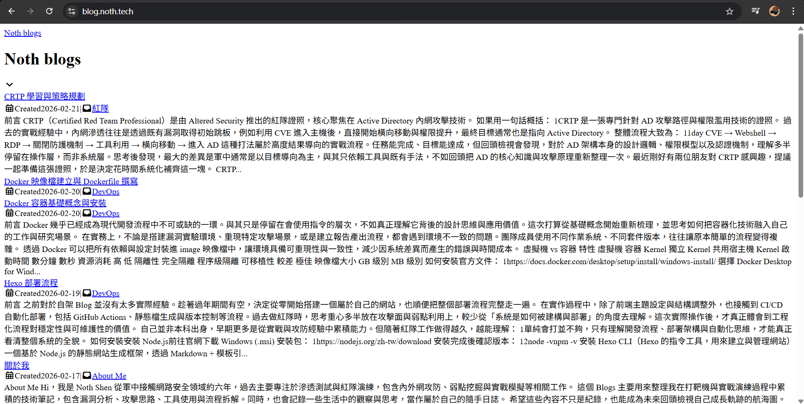

## 前言
<br>
之前對於自架 Blog 並沒有太多實際經驗。趁著過年期間有空，決定從零開始搭建一個屬於自己的網站，也順便把整個部署流程完整走一遍。

在實作過程中，除了前端主題設定與結構調整外，也接觸到 CI/CD 自動化部署，包括 GitHub Actions、靜態檔生成與版本控制等流程。過去做紅隊時，思考重心多半放在攻擊面與弱點利用上，較少從「系統是如何被建構與部署」的角度去理解。這次實際操作後，才真正體會到工程化流程對穩定性與可維護性的價值。

自己並非本科出身，早期更多是從實戰與攻防經驗中累積能力。但隨著紅隊工作做得越久，越能理解：單純會打並不夠，只有理解開發流程、部署架構與自動化思維，才能真正看清整個系統的全貌。

## 如何安裝

### 安裝 Node.js

前往官網下載 Windows (.msi) 安裝包：

```bash=
https://nodejs.org/zh-tw/download
```

安裝完成後確認版本：

```
node -v
npm -v
```



### 安裝 Hexo Cli

```
npm install -g hexo-cli
hexo -v
```


建立新專案

```
cd %USERPROFILE%\Desktop
hexo init noth-blog
cd noth-blog
npm install
```

